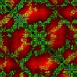
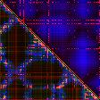

# Proteogram: an image embedding-based search approach to protein structure similarity

## Introduction

Proteogram is a novel approach to protein structure similarity search that represents protein structures as image data, enabling the use of computer vision models for efficient and accurate similarity detection. This repository leverages the SCOPe 2.08 protein structure dataset and classification hierarchy (https://scop.berkeley.edu) both to train as well as evaluate models.

### Proteogram v1: Distance, Hydrophobicity, and Charge Maps

The original Proteogram approach creates an NxN 3-channel image representation (where N is the residue length) by stacking three categories of residue-level information:

1. **Alpha-carbon backbone distances** - Pair-wise residue Cα distances (distogram)
2. **Hydrophobicity similarities** - Residue-residue hydrophobicity comparisons
3. **Charge similarities** - Residue-residue charge state comparisons

This representation captures both spatial similarity through distograms and physicochemical properties through hydrophobicity and charge maps. The resulting RGB image is inherently sequence-alignment independent and can be processed by standard computer vision models to generate embedding vectors for cosine-similarity-based search.

Example proteogram v1 (symmetric):



### Proteogram v2: Incorporating MD Simulations

Proteogram v2 extends the original approach by incorporating molecular dynamics (MD) simulations to compute physics-based residue-residue interaction energies. Instead of using static distance and property maps, v2 runs a complete MD simulation pipeline using OpenMM with the AMBER ff19SB force field to calculate:

- **Van der Waals energies** - Attractive and repulsive Lennard-Jones interactions
- **Electrostatic energies** - Attractive and repulsive Coulomb interactions

The MD pipeline includes energy minimization, NPT and NVT equilibration, and production dynamics. The resulting 3-channel data (with 6 attributes in total) provides a richer representation of protein structure that accounts for dynamic conformational sampling and explicit solvent effects.

For detailed information on the MD simulation methodology, see the two available pipelines:

- [Atomistic MD Simulation Methodology](docs/atomistic_md_simulation_methodology.md) — the all-atom pipeline using OpenMM with the AMBER ff19SB force field and explicit solvent, providing the highest-resolution physics-based interaction energies.
- [Martini MD Simulation Methodology](docs/martini_md_simulation_methodology.md) — the coarse-grained pipeline using the Martini force field, which groups atoms into beads for substantially faster simulations at the cost of atomic detail.

The v2 Proteogram approach creates an NxN 3-channel image representation (where N is the residue length) by stacking three categories of physicochemical residue-level information in the upper triangle and three categories in the lower triangle, making v2 proteograms **asymmetric**:

**Upper triangle** — MD-derived pairwise energies (AMBER ff19SB, averaged over 1 ns production trajectory) and Cα distances:

| Channel | Property | Description |
|---------|----------|-------------|
| R | VdW attractive energy | London dispersion ($r^{-6}$ term), kJ/mol; atom pairs within 0.8 nm recording cutoff |
| G | VdW repulsive energy | Pauli repulsion ($r^{-12}$ term), kJ/mol; atom pairs within 0.8 nm recording cutoff |
| B | Cα pairwise distance | All-pairs distogram from production MD trajectory (no cutoff) |

**Lower triangle** — complementary MD-pairwise energies and a chemical property:

| Channel | Property | Description |
|---------|----------|-------------|
| R | Electrostatic attractive energy | Opposite-charge residue pairs ($q_i \cdot q_j < 0$), kJ/mol; direct Coulomb, no distance cutoff |
| G | Electrostatic repulsive energy | Like-charge residue pairs ($q_i \cdot q_j > 0$), kJ/mol; direct Coulomb, no distance cutoff |
| B | Hydrophobicity delta | Absolute difference in hydrophobicity between residue pairs within the 10 Å Cα distance cutoff |

Each of the six maps is independently min-max scaled to [0–255] before combining into the final RGB image.

Example Proteogram v2 (asymmetric):



## Getting started with Proteogram v2

This repo uses Python 3.11+.

### System Requirements

**Operating System**
- Ubuntu 22.04.5 LTS or 24.04 LTS

**GPU (required for MD simulations and recommended for training/inference):**
- NVIDIA GPU with CUDA 12 support (e.g. RTX 3090, A100, H100)
- NVIDIA driver ≥ 525.x (required for CUDA 12)
- NVIDIA Container Toolkit (for Docker GPU workflows)

**CPU and RAM:**
- x86-64 CPU (AVX2 recommended for PyTorch performance)
- Minimum 32 GB system RAM; 64 GB recommended for large proteogram datasets (with creation run in parallel)

**Software:**
- Python 3.11+
- CUDA Toolkit 12.x (non-Docker GPU workflows) - see below for Docker instructions
- `uv` package manager (see [installation instructions](https://docs.astral.sh/uv/getting-started/installation/))

**MD simulation resource usage by protein length (atomistic)** (GPU-accelerated with an NVIDIA GeForce RTX 4090, Driver Version 535.288.01, CUDA Version 12.2, via OpenMM CUDA platform):

| Protein Length | Approx. Max RAM | Approx. Max GPU VRAM |
|----------------|---------|--------------|
| 50 residues   |    900 MB     |      800 MB        |
| 200 residues   |    1 GB     |      900 MB        |

**Atomistic vs. Martini CG timing**. Both columns are mean end-to-end wall-clock time (proteogram creation + embedding load + retrieval search); embedding load and retrieval are negligible relative to proteogram creation, so the atomistic MD-simulation times from the table above are used as an end-to-end proxy. Martini CG is averaged over 17–20 distinct proteins per size bucket:

| Protein Length | Atomistic (end-to-end) | Martini CG (end-to-end) | Approx. speedup |
|----------------|------------------------|-------------------------|-----------------|
| 50 residues    |          5 min         |     ~0.2 min (13 s)     |      ~23×       |
| 200 residues   |         53 min         |     ~0.4 min (26 s)     |     ~120×       |
| 500 residues   |           —            |     ~0.6 min (37 s)     |       —         |

> Martini CG runtime also scales far more gently with protein length (≈13 s → 37 s from 50 → 500 residues), whereas the atomistic path grows steeply (5 min → 53 min from 50 → 200 residues).

### Installing the package

This project uses [uv](https://docs.astral.sh/uv/) as the package manager. To install `uv`, follow the [installation instructions](https://docs.astral.sh/uv/getting-started/installation/).

#### Create a virtual environment

Create and activate a uv-managed virtual environment:
```bash
uv venv
source .venv/bin/activate  # On Unix/macOS
# or
.venv\Scripts\activate     # On Windows
```

This installs OpenMM with CPU-only support.

#### GPU installation (CUDA 12)

For systems with NVIDIA GPUs, install with CUDA 12 support for accelerated MD simulations:
```bash
uv sync --extra cuda12
```

This uses the optional `cuda12` dependencies defined in `pyproject.toml` to install `openmm-cuda-12` and related CUDA packages.

> **Note:** Ensure you have compatible NVIDIA drivers and CUDA 12 toolkit installed. See the [OpenMM documentation](http://docs.openmm.org/latest/userguide/application/01_getting_started.html#installing-openmm) for GPU requirements.

#### CPU-only installation

For systems without a GPU or for development/testing on CPU:
```bash
uv sync
```

#### [Optional] Adding dependencies

To add a package dependency:
```bash
uv add <packagename>
```

To add a development dependency:
```bash
uv add --dev <packagename>
```

### Set up configuration

Copy the example configuration file and edit it before running any pipeline step:
```bash
cp scripts/v2/config.example.yml scripts/v2/config.yml
```

All scripts read from `scripts/v2/config.yml`. The keys used at each pipeline step are listed below alongside the relevant step. A full reference is in `scripts/v2/config.example.yml`.

### Single protein inference demo

`query_similar_proteins.py`, a demo of the project inference workflow, takes a single PDB file, builds its v2 proteogram, embeds it with the trained model, and returns the top-K most similar proteins from a pre-computed corpus using cosine similarity.

This demo focuses on the **coarse-grained (CG) Martini** pipeline via `--cg_method martini`, which groups atoms into beads for substantially faster proteogram creation than the all-atom pipeline — the recommended path for interactive, single-protein inference. (Pass `--cg_method atomistic` to force the slower all-atom simulation instead.)

**The demo corpus.** The provided embeddings are built from all of SCOPe filtered with [CD-HIT](https://sites.google.com/view/cd-hit) at 40% sequence identity (15,775 proteograms), embedded with `create_corpus_embeddings.py`. That script applies the checkpoint's own size cutoff (`max_image_size=300`), so proteograms larger than 300 in either dimension are excluded, leaving **13,503 embeddings** in the corpus. This is a curated SCOPe subset for demonstrating retrieval — it is not a comprehensive PDB dataset, so results will not reflect full PDB coverage.

**Prerequisites:**

1. A trained PyTorch CNN (`.pt` file) — produced by `train_multiple_models.py` and set as `model_file` in `config.yml`. For the benchmarking model, go to the Releases in this repository and download from the latest release.
2. A pre-computed corpus embedding pickle — produced by `create_corpus_embeddings.py` (see below), set as `embed_file` in `config.yml`. For the benchmarking embeddings, go to the Releases in this repository and download from the latest release.

**Building the corpus embeddings** (skip if using the released pickle). From `scripts/v2/`, run `create_corpus_embeddings.py` against the directory of corpus proteograms. Preprocessing (grid size, resize vs. pad, size cutoff) is read from the checkpoint's own metadata, so it always matches how the model was trained:
```bash
python ../utilities/create_corpus_embeddings.py \
  --model_file proteogram_model_resnet18_lr0.001_bs8_e53_seed0_max_image_size300_input200_resize_min_class_size20_level-superfamily_lossce_acc93.9.pt \
  --embed_file resnet18_..._acc93.9_cg_embeddings.pkl \
  --dirs proteograms_v2
```
For the 15,775-proteogram SCOPe (CD-HIT 40%) corpus above, this reports the checkpoint meta (`{'architecture': 'resnet18', 'input_size': 200, 'max_image_size': 300, 'resize': True}`), resizes images to 200×200, excludes the 2,272 oversized proteograms (> 300), and saves 13,503 embeddings.

**Add the following to `scripts/v2/config.yml`** if not already present:
```yaml
model_file: /path/to/proteogram_model_resnet18_lr0.001_bs8_e53_seed0_max_image_size300_input200_resize_min_class_size20_level-superfamily_lossce_acc93.9.pt
embed_file: /path/to/resnet18_lr0.001_bs8_e53_seed0_max_image_size300_input200_resize_min_class_size20_level-superfamily_lossce_acc93.9_cg_embeddings.pkl
top_k: 5
cg_method: martini  # coarse-grained Martini pipeline for query proteogram creation
proteograms_for_sim_dir: /path/to/corpus/proteogram/images  # optional: parent or root dir containing corpus .jpg files (searched recursively)
```

> **Note:** `proteograms_for_sim_dir` is optional (allows the retrieval of the actual images themselves to build a composite image with query and targets). Set it to any directory that contains (or recursively contains) the corpus proteogram `.jpg` files. Without it, the side-by-side result image will show only the query proteogram, since the matching corpus images cannot be located on disk.


**Run from the `scripts/v2/` folder:**
```bash
cd scripts/v2
python query_similar_proteins.py \
  --pdb_file /path/to/myprotein.pdb \
  --chain_id A \
  --cg_method martini \
  --output_dir /path/to/results \
  --top_k 5
```

Arguments:
- `--pdb_file / -p`: Path to the query PDB file (required)
- `--chain_id / -c`: Chain ID to extract, e.g. `A` (required)
- `--cg_method`: `martini` (fast, coarse-grained; recommended) or `atomistic` (slow, all-atom). Defaults to `cg_method` in `config.yml`, or atomistic if unset
- `--output_dir / -o`: Directory to save the query proteogram JPG and result images (default: current directory)
- `--top_k / -k`: Number of top results to return (default: `top_k` from `config.yml`)
- `--model_file` / `--embed_file`: Override the model checkpoint / corpus embeddings from `config.yml`
- `--annot_file`: Optional SCOPe label file (`scope_eval_set_labels.tsv` format) — when provided and the query is present in it, prints a class/fold/superfamily/family agreement report for the top-K results

> The query preprocessing (grid size, resize vs. pad, and the accepted chain-length cutoff) is read from the checkpoint metadata so the query is prepared exactly as the model was trained; the flags above are only needed to override that for legacy checkpoints.

**Output:**
- The query proteogram saved as `<pdb_basename>.jpg` in `--output_dir`
- A ranked list of top-K similar proteins with cosine similarity scores printed to the console
- A side-by-side result image saved to `<output_dir>/search_results/`
- A per-step performance report (timings), plus the optional structural agreement report when `--annot_file` is given


### v2 End-to-End Train and Eval Pipeline

This workflow is meant to provide instruction on creating a database of Proteograms, training an Img2Vec model, create a corpus of Proteogram embeddings, and evaluating the Proteogram approach against other popular structure search tools.

This pipeline uses the **coarse-grained (CG) Martini** proteogram path (`cg_method: martini`), which groups atoms into beads for substantially faster proteogram creation than the all-atom pipeline. All the downstream steps (training, embedding, similarity, evaluation) operate on the resulting proteogram images and are identical regardless of which MD path produced them; only Step 1 differs. Set `cg_method` to null/empty to fall back to the slower atomistic pipeline.

All commands below are run from the `scripts/v2/` directory:
```bash
cd scripts/v2
```

---

#### Step 1 — Create Proteograms

Set in `config.yml`:
```yaml
scope_structures_dir: /path/to/pdb/structures   # input .ent/.pdb files
all_proteograms_dir:  /path/to/output/proteograms
cg_method: martini                              # 'martini' (fast, coarse-grained) or null/empty for atomistic
limit_file: /path/to/limit.lst                  # optional: one PDB ID per line
```

Run:
```bash
python create_v2_proteograms.py
```

Key optional flags:
- `--max_workers / -w`: Number of parallel worker processes (default: all available cores)
- `--overwrite`: Recreate proteograms even if they already exist
- `--verbose`: Enable verbose output and logging
- `--save_simulated_pdb`: Save the final MD simulation structure as a PDB file to a subfolder
- `--memory-efficient`: Lower peak RAM at the cost of speed (for proteins > ~150 residues on constrained hardware)
- `--sequence_len_lower_cutoff`: Minimum chain length (residues) accepted; shorter chains are skipped (default: `20`)
- `--sequence_len_upper_cutoff`: Maximum chain length (residues) accepted; longer chains are skipped (default: `200`)

> Proteogram creation runs an MD pipeline (energy minimization + equilibration + production). The Martini CG path is markedly faster than the all-atom path per protein; the atomistic path expects ~5 min for small domains (~50 residues) up to ~1 hour for larger ones (~200 residues) on a GPU. Use `--max_workers` to parallelize across cores, and split `--limit_file` across multiple instances/nodes to scale further.

> **Note:** The accepted chain-length range defaults to [20, 200] residues (`--sequence_len_lower_cutoff` / `--sequence_len_upper_cutoff`); chains outside it are skipped. The Cα distance cutoff (`calpha_atom_distance_cutoff=10` Å) remains hard-coded in [create_v2_proteograms.py](scripts/v2/create_v2_proteograms.py) — edit the script directly to change it.

This step may be used to create a single Proteogram as well for inference (including an option to save the refined structure file from the MD simulation). For the interactive single-PDB workflow, see the [Single protein inference demo](#single-protein-inference-demo) above, which selects the CG method with `--cg_method martini`.

---

#### Step 2 — Train the image embedding model

Use `train_multiple_models_randomized_eval.py`, the current trainer. It performs its own reproducible, seeded train/val/**test** split from a single directory of proteograms (no manual `train/`/`eval/` split needed) and — importantly — writes a self-describing checkpoint: the grid size (`input_size`), preprocessing mode (`resize`), and residue cutoff (`max_image_size`) are stored in the checkpoint's `meta`, so the corpus-embedding and inference scripts recover the exact preprocessing automatically. Set in `config.yml`:
```yaml
training_data_dir: /path/to/proteograms        # single dir of proteogram .jpg files
model_file_prefix: proteogram_model
```

Run (pretrained ResNet18, recommended — these are the settings behind the released demo model):
```bash
python train_multiple_models_randomized_eval.py \
  --data_dir /path/to/proteograms \
  --model resnet18 \
  --epochs 100 \
  --batch_size 8 \
  --lr 0.001 \
  --patience 10 \
  --seed 0 \
  --max_image_size 300 \
  --input_size 200 \
  --resize \
  --level superfamily \
  --min_class_size 20 \
  --loss ce \
  --save_test_list \
  --tsv_file ../data/ProteogramData_SCOP_RCSB_PDBe_AnnotationsLookup_AllSCOPe208.tsv
```

Key flags:
- `--max_image_size 300`: residue/pixel inclusion cutoff — proteograms larger than this (in either dimension) are excluded from training
- `--input_size 200 --resize`: resize each included proteogram down to a 200×200 grid (decouples the model input size from the residue cutoff; requires `--resize`)
- `--level class|fold|superfamily|family`: SCOPe hierarchy level to classify at (default: `class`)
- `--min_class_size 20`: exclude classes with fewer than N samples to limit class imbalance
- `--loss ce|focal|triplet_hierarchy`: cross-entropy (default), focal loss, or hierarchy-aware triplet loss (trains an embedding model directly for retrieval; ResNet18 only)
- `--seed 0`: random seed for the reproducible train/val/test split
- `--save_test_list`: write the held-out test-set prefixes to a `.lst` file (reuse later via `--test_list`)
- `--model cnn` / `vit`: train a from-scratch ConvNet or a ViT-B/16 instead of ResNet18
- `--exclude_classes h,i,j,k,l`: comma-separated classes to exclude
- `--overwrite`: overwrite an existing saved model file

The trained model `.pt` file is saved to `training_data_dir` with hyperparameters in the filename, e.g. `proteogram_model_resnet18_lr0.001_bs8_e53_seed0_max_image_size300_input200_resize_min_class_size20_level-superfamily_lossce_acc93.9.pt`.

> The older `train_multiple_models.py` (manual `train/`/`eval/` split, no self-describing meta) remains available for legacy workflows, but new models should use `train_multiple_models_randomized_eval.py` so preprocessing is recorded in the checkpoint.

---

#### Step 3 — Create corpus embeddings

Embed the proteogram corpus into a single portable pickle with `create_corpus_embeddings.py`. Preprocessing (grid size, resize vs. pad, and the size cutoff) is read from the checkpoint's own `meta`, so it always matches how the model was trained — proteograms larger than the checkpoint's `max_image_size` are excluded rather than silently cropped. Set in `config.yml`:
```yaml
model_file: /path/to/proteogram_model_resnet18_..._acc93.9.pt
embed_file: /path/to/resnet18_..._acc93.9_cg_embeddings.pkl
```

Run using the utility script (searches the given directories recursively for `.jpg` files):
```bash
python ../utilities/create_corpus_embeddings.py \
  --model_file /path/to/proteogram_model_resnet18_..._acc93.9.pt \
  --embed_file /path/to/resnet18_..._acc93.9_cg_embeddings.pkl \
  --dirs /path/to/proteograms
```

The script prints the resolved checkpoint meta and how many proteograms were kept vs. excluded by the size cutoff. The resulting pickle contains `{filename: embedding_tensor}` with filename-only keys (portable across machines), and is what the [Single protein inference demo](#single-protein-inference-demo) searches against.

---

#### Step 4 — Measure proteogram similarity

Set in `config.yml`:
```yaml
proteograms_for_sim_dir: /path/to/proteograms/eval   # proteograms to search across
proteogram_sim_results:  /path/to/proteogram_similarity_results.tsv
search_images_dir:       /path/to/search_images
top_k: 5
```

Run (using pre-computed embeddings from Step 3):
```bash
python measure_similarity_v2.py --no-embed
```

Or recompute embeddings for the eval set only:
```bash
python measure_similarity_v2.py
```

Key optional flags:
- `--no-embed`: Skip embedding and load from `embed_file` (faster if embeddings already exist)
- `--exclude_classes h,i,j,k,l`: Exclude classes from the search corpus

---

#### Step 5 — Run GTalign, USalign, and Foldseek (for comparison)

First copy the eval set structures to a flat directory:
```bash
python ../utilities/copy_structures_by_prefix.py \
  --prefix_file /path/to/eval.lst \
  --src_dir /path/to/pdb/structures \
  --dst_dir eval_structures
```

**GTalign:**

Download a precompiled binary from the [GTalign releases page](https://github.com/minmarg/gtalign_alpha/releases) and add it to your PATH:
```bash
wget https://github.com/minmarg/gtalign_alpha/releases/latest/download/gtalign_Linux_x86_64.tar.gz
tar -xzf gtalign_Linux_x86_64.tar.gz
export PATH="$PATH:$(pwd)/bin"   # or move the binary to /usr/local/bin
```

Run all-vs-all structural search on the eval set:
```bash
gtalign --qrs=eval_structures --rfs=eval_structures -s 0.0 -o gtalign_out
```

**US-align:**

Clone and compile from source (requires a C++ compiler):
```bash
git clone https://github.com/pylelab/USalign.git
cd USalign && make
export PATH="$PATH:$(pwd)"   # or move the binary to /usr/local/bin
```

Run all-vs-all structural search on the eval set:
```bash
ls -1 eval_structures > eval_structures_names.lst
USalign \
  -mol prot -outfmt 2 \
  -dir eval_structures eval_structures_names.lst \
  > usalign_out.tsv
```

**Foldseek:**

Install Foldseek via conda or download a static binary from the [Foldseek releases page](https://github.com/steineggerlab/foldseek/releases):
```bash
conda install -c bioconda foldseek
```

Run all-vs-all structural search on the eval set:
```bash
foldseek easy-search eval_structures/ eval_structures/ foldseek_out.tsv tmp_foldseek/ \
  --format-output "query,target,qtmscore" \
  --alignment-type 1 \
  --exhaustive-search 1 \
  -e inf \
  --max-seqs 10000
```

Key flags:
- `--format-output "query,target,qtmscore"`: outputs query ID, target ID, and TM-score normalized by query length (the correct analog to USalign's TM1 score for ranking)
- `--alignment-type 1`: forces TM-align-based structural alignment (default 3Di mode can produce near-zero scores for distant pairs when prefiltering is disabled)
- `--exhaustive-search 1`: disables the k-mer prefilter to ensure true all-vs-all comparison
- `-e inf`: removes the e-value cutoff
- `--max-seqs 10000`: sets the maximum results per query above the eval set size

> **Important:** Run Foldseek against the same `eval_structures/` directory used for GTalign and USalign. Including train-set structures will cause most targets to be absent from the evaluation label set, giving artificially low scores.

---

#### Step 6 — Evaluate all methods

Set in `config.yml`:
```yaml
scope_eval_set:       /path/to/eval.lst
gtalign_results_dir:  /path/to/gtalign_out
usalign_results:      /path/to/usalign_out.tsv
foldseek_results:     /path/to/foldseek_out.tsv   # optional
scope_cla_file:       /path/to/dir.cla.scope.2.08-stable.txt
scope_des_file:       /path/to/dir.des.scope.2.08-stable.txt
scope_hie_file:       /path/to/dir.hie.scope.2.08-stable.txt
save_bad_searches_dir:  /path/to/bad_searches
save_good_searches_dir: /path/to/good_searches
```

Run:
```bash
python evaluate_methods_v2.py
```

Key optional flags:
- `--exclude_classes h,i,j,k,l`: Match the classes excluded during training and similarity search
- `--bootstrap`: After the metric tables, report paired per-query bootstrap confidence intervals and Wilcoxon p-values for the Proteogram-minus-alignment delta at each level/metric. Since all methods score the same queries, this tests whether the margin is statistically significant and how sensitive it is to which proteins are in the test set
- `--n_boot N`: Number of bootstrap resamples for `--bootstrap` (default: `10000`)
- `--boot_seed N`: RNG seed for `--bootstrap` resampling (default: `0`)

Outputs Precision@K, MAP@K, and Recall@K for each method (Proteogram, GTalign, USalign and optionally Foldseek) at the structure class and fold levels.

### Running an MD simulation (without creating a Proteogram)

Each MD engine can be run on its own — outside proteogram creation — to run a molecular dynamics simulation and compute the residue-residue interaction energy matrices (Van der Waals and electrostatics) directly. There are two engines: `MartiniNonBondedForceModel` (coarse-grained Martini; the fast, recommended path) and `AtomisticNonBondedForceModel` (all-atom). Both share the same `run_full_pipeline()` interface and return the same set of NxN matrices.

**Coarse-grained (Martini):**

```python
from proteogram.v2 import MartiniNonBondedForceModel

model = MartiniNonBondedForceModel(
    pdb_path='protein.pdb',
    temperature=310.15,   # Kelvin (37 °C, physiological)
    timestep=10.0,        # femtoseconds (CG allows a larger timestep than all-atom)
    use_gpu=False,
    output_dir='output',
)

# Full CG MD pipeline. Returns 5 NxN matrices:
# vdw attractive/repulsive, es attractive/repulsive, and frame-averaged Cα distances.
vdw_attractive, vdw_repulsive, es_attractive, es_repulsive, dist_avg = model.run_full_pipeline(
    npt_steps=25000,            # NPT equilibration (25,000 steps ≈ 250 ps)
    nvt_steps=25000,            # NVT equilibration (25,000 steps ≈ 250 ps)
    production_steps=250000,    # production run (250,000 steps ≈ 5 ns at 20 fs/step)
    energy_calc_interval=5000,  # steps between energy-snapshot frames
    return_simulated_pdb=False,
    debug=True,
)

print('VdW attractive matrix shape:', vdw_attractive.shape)
print('Electrostatic repulsive matrix shape:', es_repulsive.shape)

model.cleanup_all_resources()
```

> The Martini engine works in explicit solvent on a coarse-grained bead representation, so it runs markedly faster than the all-atom engine. `subtract_solvent_energies` is accepted for API compatibility but is a no-op for CG.

**All-atom (atomistic):**

To run the full-resolution all-atom simulation instead, swap in `AtomisticNonBondedForceModel`. Its constructor also takes `pressure` (atm) and `padding` (nm, water-box padding), uses a smaller `timestep` (2.0 fs), and its `run_full_pipeline()` honors `subtract_solvent_energies=True`. It returns the same 5 matrices and is cleaned up with `model.cleanup()`.

```python
from proteogram.v2 import AtomisticNonBondedForceModel

model = AtomisticNonBondedForceModel(
    pdb_path='protein.pdb',
    temperature=311.75,   # Kelvin
    pressure=1.0,         # atmospheres
    padding=1.0,          # nanometers (water box padding around protein)
    timestep=2.0,         # femtoseconds
    use_gpu=False,
    output_dir='output',
)

vdw_attractive, vdw_repulsive, es_attractive, es_repulsive, dist_avg = model.run_full_pipeline(
    npt_steps=50000,            # NPT equilibration (50,000 steps ≈ 100 ps)
    nvt_steps=50000,            # NVT equilibration (50,000 steps ≈ 100 ps)
    production_steps=500000,    # production run (500,000 steps ≈ 1 ns at 2 fs/step)
    energy_calc_interval=10000, # steps between energy snapshots
    return_simulated_pdb=False,
    subtract_solvent_energies=True,
    debug=True,
)

model.cleanup()
```

For detailed information on the MD simulation methodology, force calculations, and energy validation, see the [Martini MD Simulation Methodology](docs/martini_md_simulation_methodology.md) (coarse-grained) and the [Atomistic MD Simulation Methodology](docs/atomistic_md_simulation_methodology.md) (all-atom).

## Scripts reference

Scripts are organized into three subfolders under `scripts/`:

- `scripts/v2/` — Proteogram v2 pipeline (MD-based, recommended)
- `scripts/v1/` — Proteogram v1 pipeline (distance/hydrophobicity/charge maps)
- `scripts/utilities/` — Data preparation utilities

The `v1` and `v2` subfolders have their own `config.yml` (copy from the corresponding `config.example.yml`). The following table lists all scripts, their purpose, and the configuration variables or command-line arguments they use. It is recommended to have the main `data` folder directly under the `scripts` folder for common access.

### `scripts/v2/`

| Script | Purpose | Config Variables (`config.yml`) | Command-Line Arguments |
|--------|---------|--------------------------------|------------------------|
| `v2/create_v2_proteograms.py` | Create proteograms using MD-based nonbonded energy calculations, distances, and hydrophobicity deltas. `cg_method: martini` selects the fast coarse-grained path; null/empty uses the all-atom path. Note: `calpha_atom_distance_cutoff=10` Å is **hard-coded** in the script (not config/CLI) | `limit_file`, `scope_structures_dir`, `all_proteograms_dir`, `cg_method` | `--max_workers/-w`, `--overwrite`, `--verbose`, `--debug`, `--memory-efficient`, `--save_simulated_pdb`, `--sequence_len_lower_cutoff` (default 20), `--sequence_len_upper_cutoff` (default 200) |
| `v2/query_similar_proteins.py` | Create a proteogram for a single query PDB and find the top-K most similar proteins from a pre-computed corpus | `top_k`, `model_file`, `embed_file`, `cg_method`, `proteograms_for_sim_dir` (optional — parent or root directory containing corpus `.jpg` files, searched recursively, needed for result image) | `--pdb_file/-p`, `--chain_id/-c`, `--cg_method` (`martini`\|`atomistic`), `--output_dir/-o`, `--top_k/-k`, `--model_file`, `--embed_file`, `--annot_file` (optional agreement report), `--target_size`, `--resize/--no-resize`, `--sequence_len_lower_cutoff`, `--sequence_len_upper_cutoff`. Preprocessing (grid/resize/cutoff) defaults to the checkpoint meta |
| `v2/measure_similarity_v2.py` | Batch similarity search across all proteograms | `top_k`, `model_file`, `embed_file`, `proteogram_sim_results`, `proteograms_for_sim_dir`, `search_images_dir` | `--exclude_classes/-x`, `--overwrite`, `--embed/--no-embed` |
| `v2/train_multiple_models_randomized_eval.py` | **Current trainer.** Train ResNet18/ConvNet/ViT-B/16 with a reproducible seeded train/val/**test** split from a single directory; writes a self-describing checkpoint (grid/resize/cutoff in `meta`). Supports classification (`ce`/`focal`) and retrieval (`triplet_hierarchy`) losses | `training_data_dir`, `model_file_prefix`, `pretrained` | `--data_dir/-d`, `--model/-m` (`cnn`\|`resnet18`\|`vit`), `--epochs/-e`, `--batch_size/-b`, `--lr/-l`, `--pretrained/--no-pretrained`, `--seed`, `--max_image_size`, `--input_size`, `--resize`, `--level`, `--min_class_size`, `--loss` (`ce`\|`focal`\|`triplet_hierarchy`), `--patience`, `--val_size`, `--test_size`, `--save_test_list/--no-save_test_list`, `--save_train_list`, `--test_list`, `--exclude_classes/-x`, `--tsv_file/-t`, `--overwrite/-o`, `--verbose/-v` (plus `--triplet_*`, `--focal_gamma`, `--embed_dim` for the respective losses) |
| `v2/train_multiple_models.py` | Legacy trainer (manual `train/`/`eval/` split, no self-describing meta). Prefer the randomized-eval trainer above for new models | `training_data_dir`, `num_epochs`, `learning_rate`, `batch_size`, `scope_level`, `model_file_prefix` | `--data_dir/-d` (overrides `training_data_dir`), `--epochs/-e`, `--batch_size/-b`, `--lr/-l`, `--model/-m` (`cnn`\|`resnet18`), `--level` (`class`\|`fold`\|`superfamily`\|`family`, default: `class`), `--tsv_file/-t`, `--patience`, `--val_size`, `--exclude_classes/-x`, `--overwrite/-o`, `--resize`, `--verbose/-v` |
| `v2/evaluate_methods_v2.py` | Evaluate proteogram approach vs GTalign, USalign, and Foldseek | `top_k`, `scope_eval_set`, `proteogram_sim_results`, `gtalign_results_dir`, `usalign_results`, `foldseek_results` (optional), `search_images_dir`, `save_bad_searches_dir`, `save_good_searches_dir`, `scope_cla_file`, `scope_des_file`, `scope_hie_file` | `--overwrite`, `--exclude_classes/-x`, `--bootstrap`, `--n_boot` (default 10000), `--boot_seed` (default 0) |
| `v2/create_scope_annotation_file.py` | Generate an annotation lookup file (SCOPe pipeline) from SCOPe-named structures, with GO terms | `limit_file`, `scope_structures_dir`, `annot_file`, `fasta_style_file`, `scope_cla_file`, `scope_des_file`, `scope_hie_file`, `go_obo_file`, `goslim_obo_file` | None |
| `v2/create_pdb_annotation_file.py` | Generate an annotation lookup file (PDB pipeline, no SCOPe) from per-chain monomer PDBs, with GO terms | `pdb_monomers_dir`, `annot_file`, `fasta_style_file`, `limit_file`, `go_obo_file`, `goslim_obo_file` | None |
| `v2/create_balanced_scope_train_eval_lists.py` | Create balanced train/eval splits from CD-HIT clustered results | None | `--lst-file/-l`, `--lookup-tsv/-t`, `--class-column/-c`, `--id-column/-i`, `--n-per-class/-n`, `--eval-fraction/-e`, `--no-eval`, `--train-output`, `--eval-output`, `--split-train`, `--split-eval`, `--exclude-classes`, `--seed/-s` |

### `scripts/v1/`

| Script | Purpose | Config Variables (`config.yml`) | Command-Line Arguments |
|--------|---------|--------------------------------|------------------------|
| `v1/create_proteograms.py` | Create proteograms using distances, hydrophobicity deltas, and charge maps | `scope_structures_dir`, `eval_proteograms_dir`, `limit_file` | None |
| `v1/measure_similarity_single_domain.py` | Search a single structure against a proteogram database (query path hardcoded in script) | `top_k`, `model_file`, `embed_file`, `embed_file_exists`, `proteogram_sim_results`, `proteograms_dir_single_search` | None |
| `v1/measure_similarity.py` | Batch similarity search across all proteograms | `top_k`, `model_file`, `embed_file`, `proteogram_sim_results`, `proteograms_for_sim_dir`, `search_images_dir` | None |
| `v1/evaluate_methods.py` | Evaluate proteogram approach vs GTalign and USalign | `top_k`, `scope_eval_set`, `proteogram_sim_results`, `gtalign_results_dir`, `usalign_results`, `search_images_dir`, `save_bad_searches_dir`, `save_good_searches_dir`, `scope_cla_file`, `scope_des_file`, `scope_hie_file` | None |
| `v1/make_training_and_eval_data.py` | Create training/validation datasets with SCOPe annotations | `scope_eval_set`, `scope_structures_dir`, `scope_cla_file`, `scope_des_file`, `scope_hie_file`, `training_structures_dir`, `training_proteograms_dir`, `eval_structures_dir`, `eval_proteograms_dir`, `label_df_out` | None |
| `v1/make_training_data_exclude_eval.py` | Create training data excluding evaluation set proteins | `scope_eval_set`, `scope_structures_dir`, `scope_cla_file`, `scope_des_file`, `scope_hie_file`, `training_structures_dir`, `training_proteograms_dir`, `eval_structures_dir`, `eval_proteograms_dir`, `label_df_out`, `scope_level` | None |

### `scripts/utilities/`

| Script | Purpose | Config Variables | Command-Line Arguments |
|--------|---------|-----------------|------------------------|
| `utilities/create_corpus_embeddings.py` | Embed all proteograms found recursively across one or more directories into a single portable `{filename: embedding}` corpus pickle; preprocessing is read from the checkpoint meta | None | `--model_file/-m`, `--embed_file/-e`, `--dirs/-d` (one or more), `--target_size`, `--resize/--no-resize`, `--max_image_size` (last three override legacy checkpoints without meta) |
| `utilities/create_ablation_proteograms.py` | Create per-channel ablation image sets (each of the 6 channel/triangle combinations isolated, others set to the dataset mean) for interpretability studies | None | `input_dir` (positional), `output_dir` (positional) |
| `utilities/split_pdb_into_chains.py` | Split downloaded PDB files into per-chain monomer files (`{PDBID}_{CHAIN}.pdb`) | `pdb_download_dir`, `pdb_monomers_dir` | None |
| `utilities/download_pdb_before_date.py` | Download all RCSB PDB structures deposited before a given date | None | `--before` (YYYY-MM-DD, required), `--output-dir` (required), `--format` (`pdb`\|`cif`), `--workers`, `--ids-file` |
| `utilities/copy_structures.py` | Copy structure files filtered by amino acid length | None (hardcoded paths in script) | None |
| `utilities/copy_structures_by_prefix.py` | Copy structure files matching a prefix list from a source to destination directory | None | `--prefix_file/-p`, `--src_dir/-s`, `--dst_dir/-d`, `--overwrite/-o` |
| `utilities/find_structures_in_scope.py` | Find PDB structures present in the SCOPe 2.08 database | None (hardcoded paths in script) | None |
| `utilities/get_structures_scope20840_list.py` | Download and parse PDB structures by chain from SCOPe 2.08 | None (hardcoded paths in script) | None |

> **Note:** Scripts with "None (hardcoded paths in script)" require editing the script directly to set file paths. See `config.example.yml` in the relevant subfolder for descriptions of all configuration variables.

## References

1. **GTalign** - Margelevicius, M. (2024). GTalign: High-performance protein structure alignment, superposition, and search. *Nature Communications*, 15, 1261. https://doi.org/10.1038/s41467-024-45653-4

2. **US-align** - Zhang, C., Shine, M., Pyle, A.M., & Zhang, Y. (2022). US-align: universal structure alignments of proteins, nucleic acids, and macromolecular complexes. *Nature Methods*, 19, 1109–1115. https://doi.org/10.1038/s41592-022-01585-1

3. **SCOPe 2.08** - Chandonia, J.M., Fox, N.K., & Brenner, S.E. (2017). SCOPe: Manual curation and artifact removal in the Structural Classification of Proteins - extended database. *Journal of Molecular Biology*, 429(3), 348-355. https://doi.org/10.1016/j.jmb.2016.11.023

4. **OpenMM** - Eastman, P., Swails, J., Chodera, J.D., McGibbon, R.T., Zhao, Y., Beauchamp, K.A., Wang, L.P., Simmonett, A.C., Harrigan, M.P., Stern, C.D., Wiewiora, R.P., Brooks, B.R., & Pande, V.S. (2017). OpenMM 7: Rapid development of high performance algorithms for molecular dynamics. *PLOS Computational Biology*, 13(7), e1005659. https://doi.org/10.1371/journal.pcbi.1005659

5. **AMBER ff19SB** - Tian, C., Kasavajhala, K., Belfon, K.A.A., Raguette, L., Huang, H., Migues, A.N., Bickel, J., Wang, Y., Pincay, J., Wu, Q., & Simmerling, C. (2020). ff19SB: Amino-Acid-Specific Protein Backbone Parameters Trained against Quantum Mechanics Energy Surfaces in Solution. *Journal of Chemical Theory and Computation*, 16(1), 528-552. https://doi.org/10.1021/acs.jctc.9b00591

6. **Foldseek** - van Kempen, M., Kim, S.S., Tumescheit, C., Mirdita, M., Lee, J., Gilchrist, C.L.M., Söding, J., & Steinegger, M. (2024). Fast and accurate protein structure search with Foldseek. *Nature Biotechnology*, 42, 243–246. https://doi.org/10.1038/s41587-023-01773-0

7. **ResNet** - He, K., Zhang, X., Ren, S., & Sun, J. (2016). Deep Residual Learning for Image Recognition. *Proceedings of the IEEE Conference on Computer Vision and Pattern Recognition (CVPR)*, 770-778. https://doi.org/10.1109/CVPR.2016.90


# Docker Guide (uv based)

This repo is dockerized to run scripts under `/scripts` (e.g. measure_similarity.py, create_proteograms.py etc.)

## CPU vs GPU containers (important)

Docker images do **not** automatically get GPU access at build time.
GPU access is assigned **when you run the container**.

- Use a CPU image/container for CPU workflows.
- Use a GPU-capable image/container for GPU workflows.
- Start the GPU container with `--gpus ...` (or the equivalent in Compose/Kubernetes).

Also note: `--platform` (for example `linux/amd64` or `linux/arm64`) controls CPU architecture, **not** whether GPU is attached.

## Prerequisites
- Docker installed
- `uv.lock` present in repo root (recommended for reproducible builds)
- For GPU containers: NVIDIA driver + NVIDIA Container Toolkit installed on the host

## `uv.lock` usage (important for Docker builds)

Both Dockerfiles install dependencies with:

```bash
uv sync --active --frozen ...
```

`--frozen` means the build will fail if `uv.lock` is missing or out of sync with
`pyproject.toml`.

### When you change dependencies

If you edit `pyproject.toml` (or dependency extras), regenerate and commit the lockfile:

```bash
uv lock
uv sync --frozen
git add pyproject.toml uv.lock
```

### Common error: lockfile mismatch

If Docker build fails around `uv sync --frozen`, run:

```bash
uv lock
```

Then rebuild the image.

## Supported Docker platforms

- **CPU image (`Dockerfile`)**
  - Intended for standard Linux Docker platforms.
  - Commonly works on: `linux/amd64`, `linux/arm64`.

- **GPU image (`Dockerfile.gpu`)**
  - Intended for Linux hosts with NVIDIA GPU runtime support.
  - Primary supported platform: `linux/amd64`.

### Notes on platform vs GPU

- `--platform` selects CPU architecture (for example `linux/amd64`, `linux/arm64`).
- GPU access is assigned at runtime with `--gpus ...`.
- GPU use also depends on host setup (NVIDIA drivers + NVIDIA Container Toolkit).

---

## Build the Docker image

From the repo root (the folder that contains `Dockerfile`, `pyproject.toml`, `uv.lock`):

```
sudo docker build -t proteogram:dev .
```

For clarity, build/tag CPU and GPU images explicitly:

```bash
sudo docker build -t proteogram:cpu .
```

GPU image (uses `Dockerfile.gpu` and installs `cuda12` extra dependencies via uv):

```bash
sudo docker build -f Dockerfile.gpu -t proteogram:gpu .
```

> `Dockerfile` = CPU image; `Dockerfile.gpu` = GPU-capable Python environment.
> GPU access is still granted only at runtime with `--gpus ...`.

## Verify the image

Verify Python and package import
```
docker run --rm proteogram:dev python -c "import proteogram; print('import ok')"
```

Verify scripts inside the container
```
docker run --rm proteogram:dev python scripts/measure_similarity.py
```

## Run CPU container

Run normally (no GPU flags):

```bash
docker run --rm -it proteogram:cpu bash
```

## Run GPU container

Assign GPU at runtime with Docker's `--gpus` flag:

```bash
docker run --rm --gpus all -it proteogram:gpu bash
```

Use a specific GPU device (example GPU 0 only):

```bash
docker run --rm --gpus '"device=0"' -it proteogram:gpu bash
```

Verify OpenMM can see CUDA platform in GPU container:

```bash
docker run --rm --gpus all proteogram:gpu \
  python -c "from openmm import Platform; print([Platform.getPlatform(i).getName() for i in range(Platform.getNumPlatforms())])"
```

You should see `CUDA` in the printed platform list.

For CPU-only service, use `proteogram:cpu` and omit GPU device reservations.

Interactively login to container and inspect the contents to see expected files.
```
docker run --rm -it proteogram:dev bash
```

### Mount the datasets 
Note: `-v` bind mounts are applied **only at container run time**. The data is
not stored in the image and will not be present unless you start the container
with the `-v` flag.
```
sudo docker run --rm -it \
  -v "$(pwd)/scripts/data/pdbstyle-2.08:/app/scripts/data/pdbstyle-2.08" \
  proteogram:dev \
  bash
```

# Troubleshooting

## OpenMM CUDA error: `CUDA_ERROR_UNSUPPORTED_PTX_VERSION (222)`

**Symptom** — MD simulation (e.g. energy minimization in `query_similar_proteins.py` or `create_v2_proteograms.py`) crashes when the OpenMM `Simulation`/`Context` is created:

```
openmm.OpenMMException: Error loading CUDA module: CUDA_ERROR_UNSUPPORTED_PTX_VERSION (222)
```

**Cause** — This is *not* an OpenMM-version problem. OpenMM JIT-compiles its CUDA kernels at runtime, and the PTX ISA it emits is determined by the `nvidia-cuda-nvrtc-cu12` / `nvidia-cuda-nvcc-cu12` toolchain packages. A CUDA driver only JITs PTX from its own CUDA version and older — a driver reporting **CUDA 12.2** (e.g. NVIDIA driver 535.x) accepts PTX from toolkits 12.0–12.2 but **not** 12.3+. If the nvrtc/nvcc packages resolve to a newer build (12.6+/12.9), the emitted PTX is too new and the driver's JIT rejects it with error 222.

**Fix** — Pin the JIT toolchain (and the paired torch cu121 runtime) to a CUDA ≤12.2 build. This is already done in the `cuda12` optional-dependencies extra in [`pyproject.toml`](pyproject.toml):

```toml
[project.optional-dependencies]
cuda12 = [
  "openmm==8.4.0",
  "openmm-cuda-12==8.4.0.post2",
  "nvidia-cuda-nvrtc-cu12==12.1.105",  # emit PTX loadable by CUDA 12.2 drivers
  "nvidia-cuda-nvcc-cu12==12.1.105",
  "torch==2.3.0",                       # cu121 runtime, coherent with the pins above
  "torchvision==0.18.0",
]
```

If you hit this on an existing environment, reinstall the toolchain at the pinned versions:

```bash
uv sync --extra cuda12
# or, for a plain pip venv:
pip install nvidia-cuda-nvrtc-cu12==12.1.105 nvidia-cuda-nvcc-cu12==12.1.105
```

Then verify:

```bash
python -m openmm.testInstallation
```

**Check your driver's CUDA ceiling** with `nvidia-smi` (top-right "CUDA Version"). The pins above target the 12.2 ceiling of the 535.x driver line. If instead you have **root and a newer driver** (550+/CUDA 12.4+), the more durable fix is to update the driver and keep the newer toolchain — the driver's JIT will then accept the newer PTX and these pins become unnecessary.